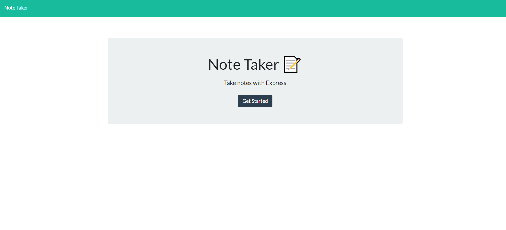
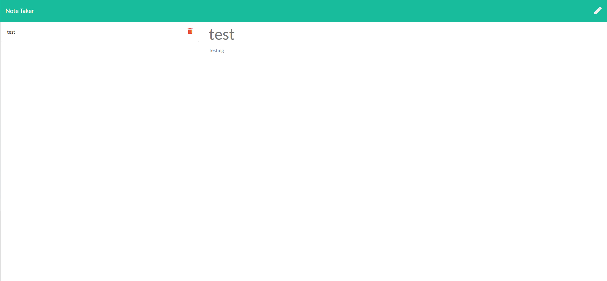

# Note Taker 
# Application that connects the client front end to a server back end
# using express. The site renders, saves and deletes notes.  The notes
# are stored as a json file on the server and can be modified.

# deployed app: https://tranquil-ocean-80054.herokuapp.com/

